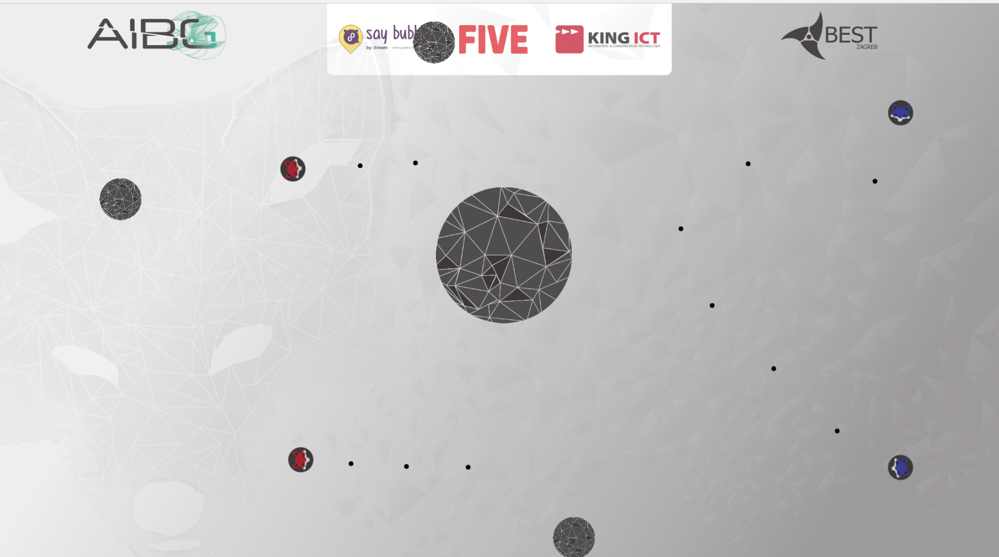

# AIBG

Artificial Intelligence BattleGround 2-day hackathon.

Hackathon official page: http://www.best.hr/aibg

Facebook group: https://www.facebook.com/BESTCodeChallenge/

## Team 

*nAIvci*
- [Marina Krček](https://github.com/Marina7)
- [Vilim Stubičan](https://github.com/jewbre)
- [Zoran Krišto](https://github.com/zoxparty)
- [Filip Popić](https://github.com/fpopic)

## Running

1. Package bot into a .jar file
    ```bash
    cd bot
    mvn package
    ```

2. Copy `.jar` to java binding folder
    ```bash
    cp bot/target/ai-bot.jar demo-bindings/java-bindings/ai-bot.jar
    ```

3. Run `asteroids.jar` server
    ```bash
    java -jar asteroids.jar myconfig.json
    ```

4. Start the game opening html file that connects to server via websocket (our bots are red)
    ```html
    webapp/index.html
    ```



